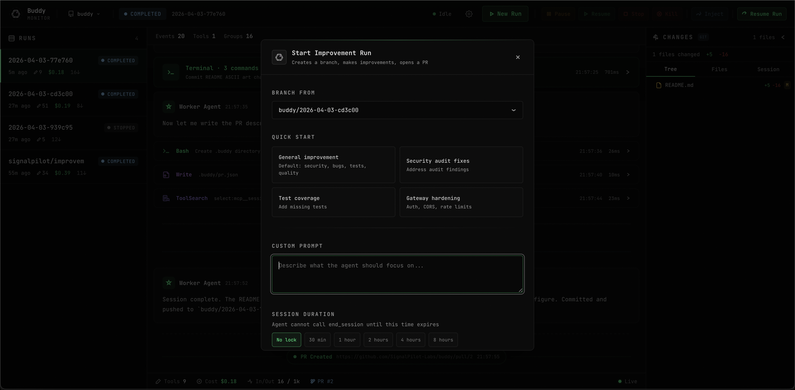
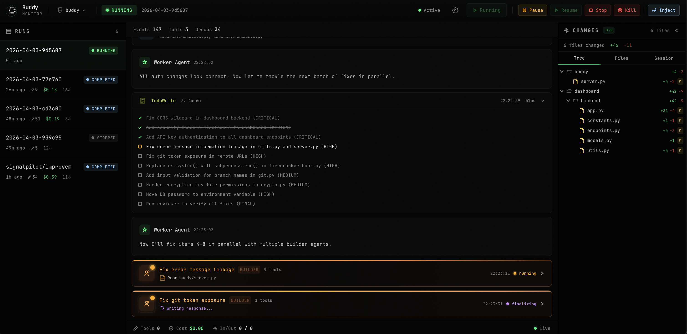

<div align="center">

<h1>buddy</h1>

**autonomous coding agent. give it a repo, get back a PR.**

long-running sessions · sandboxed execution · live supervision



<br/>



</div>

---

Set a task, set a time limit, walk away. Run it for 30 minutes or 8+ hours — it plans, builds, reviews, and commits until the clock runs out. Code executes in isolated Sandboxes and never on your machine.

**Requirements:** Docker Desktop (macOS / Linux / Windows)

## Quick start

```bash
curl -fsSL https://raw.githubusercontent.com/SignalPilot-Labs/buddy/main/install.sh | bash
```

Prompts for credentials interactively. For non-interactive or CI installs, set env vars before piping:

```bash
ANTHROPIC_API_KEY=sk-ant-... GITHUB_TOKEN=ghp_... GITHUB_REPO=owner/repo \
  curl -fsSL https://raw.githubusercontent.com/SignalPilot-Labs/buddy/main/install.sh | bash
```

Credentials are saved automatically during install. To update them later, use `buddy settings set` or the web UI at [http://localhost:3400](http://localhost:3400).

To update an existing install: `buddy update`

### Run

```bash
buddy run new -p "Fix authentication bugs" -d 30
```

If you're inside a git repo, buddy auto-detects it — no need to specify `--github-repo`:

```bash
cd your-project/
buddy run new -p "Fix authentication bugs" -d 30
```

### Monitor

Use the CLI or open [http://localhost:3400](http://localhost:3400).

```bash
buddy run                            # interactive run selector
buddy run get <run_id>               # run details + action menu
```

## CLI reference

```
# Services
buddy start                          # start services (fast, no rebuild)
buddy stop                           # stop all services
buddy update                         # pull latest code + rebuild images
buddy logs                           # stream all container logs (Ctrl+C to stop)
buddy logs 50                        # tail last 50 lines + follow
buddy kill                           # remove all containers
buddy open                           # open dashboard in browser
buddy doctor                         # run health checks + print fixes
buddy uninstall                      # remove containers, images, volumes, ~/.buddy/

# Runs
buddy run                            # interactive run selector
buddy run new -p "Fix auth bugs"     # start a new run
buddy run list                       # list recent runs
buddy run get <run_id>               # show run details + action menu

# Settings & config
buddy settings status                # check credential config
buddy settings get                   # show all settings (masked)
buddy settings set --claude-token TOKEN --git-token TOKEN --github-repo owner/repo

# Repos (auto-detects local git repo)
buddy repos list                     # list repos with run counts
buddy repos detect                   # detect git repo in current directory
buddy repos set-active owner/repo    # set active repo
buddy repos remove owner/repo        # remove a repo

# Agent
buddy agent health                   # check agent status
buddy agent branches                 # list git branches

# CLI config
buddy config get                     # show CLI config
buddy config set --api-key KEY       # update CLI config
buddy config show-key                # print the dashboard API key
```

Use `--json` on any command for machine-readable output.

---

Built with the [Claude Agent SDK](https://docs.anthropic.com/en/docs/claude-code/sdk). MIT License.
