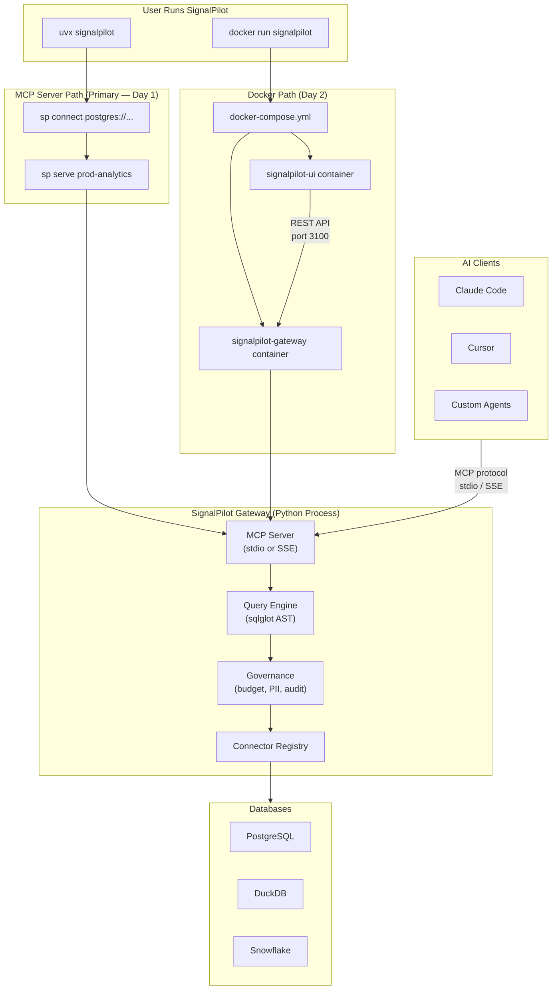
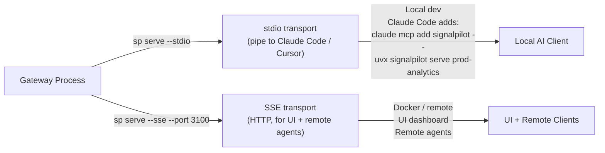
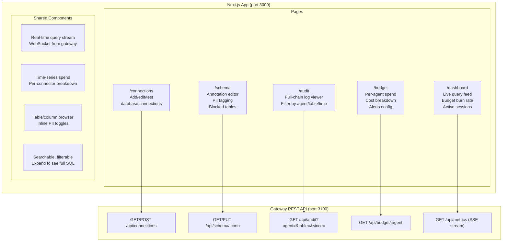
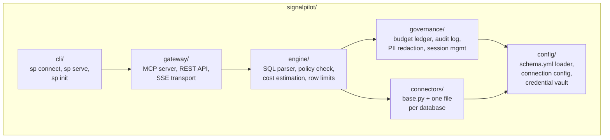
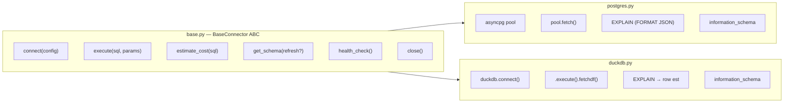
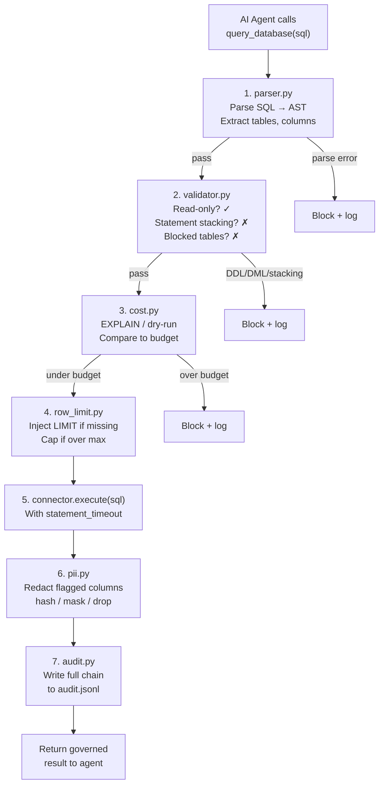
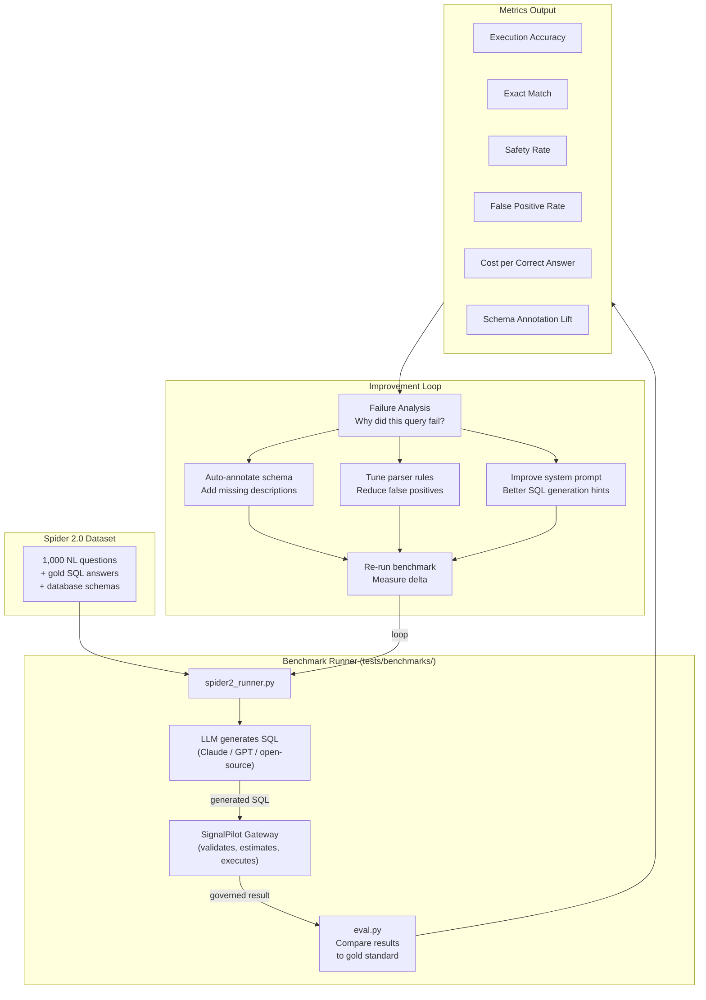
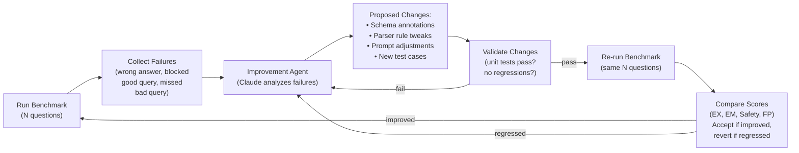
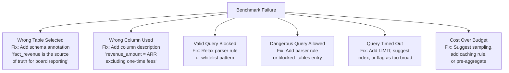

# SignalPilot: Next 72 Hours
**Date:** March 30, 2026
**Goal:** Buildable systems design for four workstreams — ship the skeleton, prove it works, measure it against the best public benchmark.

---

## Workstream Overview

```
 Day 1 (Mon)                    Day 2 (Tue)                     Day 3 (Wed)
 ───────────                    ───────────                     ───────────
 Project scaffold               UI shell + dashboard            Spider 2.0 harness
 Postgres connector             MCP server wired to UI          First benchmark run
 SQL parser (read-only)         Docker image builds             Improvement loop v1
 Audit log writes               `sp connect` CLI works          Publish results
```

---

## 1. Delivery Mode: How SignalPilot Gets to Users

Three delivery surfaces, one gateway core.



### Delivery Priority

| Surface | Day | What Ships | How |
|---------|-----|-----------|-----|
| **MCP Server** (`uvx signalpilot serve`) | Day 1 | `sp connect` + `sp serve` — working MCP endpoint over stdio | `uvx` runs directly from PyPI, zero install. Also: `claude mcp add signalpilot -- uvx signalpilot serve prod-analytics` |
| **Docker** | Day 2 | `docker-compose up` — gateway + UI in two containers | Dockerfile + compose.yml, gateway exposes SSE on port 3100 |
| **UI** | Day 2-3 | Next.js dashboard at `localhost:3000`, talks to gateway REST API | Separate container, optional — MCP server works without it |

### MCP Transport Decision



**Day 1:** stdio only (simplest, works immediately with Claude Code).
**Day 2:** Add SSE endpoint so the UI container and remote agents can connect.

---

## 2. UI: Next.js/React Frontend

The UI is a monitoring and management dashboard, not a query interface. The AI client (Claude Code, Cursor) is where queries happen. The UI shows what's happening.



### UI Folder Structure

```
signalpilot-ui/
├── app/
│   ├── layout.tsx                  # Shell: sidebar nav, header
│   ├── dashboard/
│   │   └── page.tsx                # Live feed + budget burn + session count
│   ├── connections/
│   │   ├── page.tsx                # Connection list
│   │   └── [id]/page.tsx           # Edit connection, test, view schema
│   ├── schema/
│   │   └── page.tsx                # Schema tree + annotation editor
│   ├── audit/
│   │   └── page.tsx                # Audit log table with filters
│   └── budget/
│       └── page.tsx                # Per-agent cost breakdown
├── components/
│   ├── query-feed.tsx              # Real-time query stream (WebSocket)
│   ├── cost-chart.tsx              # Recharts time-series
│   ├── schema-tree.tsx             # Expandable table/column tree
│   ├── audit-table.tsx             # Sortable, filterable table
│   ├── connection-form.tsx         # Add/edit connection dialog
│   └── pii-badge.tsx               # PII indicator + redaction rule selector
├── lib/
│   ├── api.ts                      # Fetch wrapper for gateway REST API
│   └── types.ts                    # Shared TypeScript types
├── Dockerfile
├── package.json
└── next.config.ts
```

### What Ships Each Day

| Day | UI Deliverable |
|-----|----------------|
| Day 2 morning | `layout.tsx` shell with sidebar nav. `/connections` page that can add a Postgres connection. |
| Day 2 afternoon | `/dashboard` with live query feed (SSE from gateway). `/audit` table rendering JSONL entries. |
| Day 3 | `/schema` annotation editor. `/budget` per-agent breakdown. Docker image builds and `docker-compose up` works end to end. |

---

## 3. DB Connector System: Project Structure



### Full Folder Layout

```
signalpilot/
├── pyproject.toml                      # Package metadata, dependencies, [project.scripts] entry points for uvx
├── signalpilot/
│   ├── __init__.py
│   │
│   ├── cli/                            # CLI entry points
│   │   ├── __init__.py
│   │   ├── main.py                     # Click/Typer app, `sp` command group
│   │   ├── connect.py                  # `sp connect <uri>` — register a connection
│   │   ├── serve.py                    # `sp serve <name>` — start MCP server
│   │   └── init.py                     # `sp init` — generate schema.yml from DB
│   │
│   ├── gateway/                        # MCP server + REST API
│   │   ├── __init__.py
│   │   ├── mcp_server.py              # MCP tool definitions (connect, query, etc.)
│   │   ├── rest_api.py                # FastAPI REST endpoints for UI
│   │   ├── sse.py                     # SSE transport for remote MCP + live feed
│   │   └── session.py                 # GovernanceSession — closure over state
│   │
│   ├── engine/                         # Query engine pipeline
│   │   ├── __init__.py
│   │   ├── parser.py                  # sqlglot: parse → AST → extract tables/cols
│   │   ├── validator.py               # Read-only check, statement stacking, blocked tables
│   │   ├── cost.py                    # EXPLAIN/dry-run dispatcher per connector
│   │   ├── row_limit.py              # LIMIT injection / override
│   │   └── timeout.py                # Per-query timeout with DB-side cancellation
│   │
│   ├── connectors/                     # One file per database
│   │   ├── __init__.py
│   │   ├── base.py                    # BaseConnector ABC:
│   │   │                              #   connect, execute, estimate_cost,
│   │   │                              #   get_schema, health_check, close
│   │   ├── postgres.py                # asyncpg — Day 1
│   │   ├── duckdb.py                  # duckdb — Day 1 (local, zero-config)
│   │   ├── snowflake.py               # snowflake-connector-python — Day 3+
│   │   ├── mysql.py                   # aiomysql — Week 2+
│   │   ├── bigquery.py                # google-cloud-bigquery — Week 2+
│   │   ├── databricks.py              # databricks-sql-connector — Week 3+
│   │   ├── redshift.py                # redshift_connector — Week 3+
│   │   └── registry.py               # ConnectorRegistry.get(db_type) → connector
│   │
│   ├── governance/                     # Budget, audit, PII, sessions
│   │   ├── __init__.py
│   │   ├── budget.py                  # Per-agent/session budget ledger (SQLite)
│   │   ├── audit.py                   # Append-only JSONL audit log writer
│   │   ├── pii.py                     # Column-level redaction (hash/mask/drop)
│   │   └── session.py                # Session lifecycle: open, track, close, teardown
│   │
│   ├── config/                         # Configuration loading
│   │   ├── __init__.py
│   │   ├── schema_loader.py           # Parse schema.yml → SchemaInfo
│   │   ├── connections.py             # Load/save connection configs (~/.signalpilot/)
│   │   └── vault.py                   # Credential vault (encrypted at rest)
│   │
│   └── sandbox/                        # E2B integration (optional, only for run_analysis)
│       ├── __init__.py
│       ├── manager.py                 # Create/kill/pause E2B sandboxes
│       ├── cost.py                    # Derive sandbox cost from timestamps + formula
│       └── agent.py                   # In-VM signalpilot.sandbox_agent process
│
├── tests/
│   ├── test_parser.py                  # SQL validation: read-only, stacking, blocked
│   ├── test_connectors.py             # Connector interface compliance
│   ├── test_governance.py             # Budget, PII, audit
│   ├── test_engine.py                 # Full pipeline: parse → validate → execute
│   └── benchmarks/                     # Spider 2.0 benchmark harness (see section 4)
│       ├── spider2_runner.py
│       ├── eval.py
│       └── improve.py
│
├── docker/
│   ├── Dockerfile.gateway              # Gateway container
│   ├── Dockerfile.ui                   # Next.js UI container
│   └── docker-compose.yml             # Both containers + optional Postgres for testing
│
└── e2b/
    ├── e2b.toml                        # E2B template config
    └── e2b.Dockerfile                  # Custom sandbox template
```

### Connector Interface (Day 1 — the contract everything builds on)



### Data Flow Through the Engine (Day 1)



---

## 4. Benchmarking: Spider 2.0 + Recursive Improvement Loop

### What Is Spider 2.0?

Spider 2.0 is the industry-standard text-to-SQL benchmark. ~1,000 complex natural-language questions against real-world databases. It's what every text-to-SQL system is evaluated against. If we can show that SignalPilot governance **improves** accuracy (not just safety), that's our killer competitive claim.

### What We Measure

| Metric | What It Proves | How We Measure |
|--------|---------------|----------------|
| **Execution Accuracy (EX)** | Generated SQL returns the correct result set | Compare output rows to Spider 2.0 gold-standard answers |
| **Exact Match (EM)** | Generated SQL exactly matches the gold SQL | AST-level comparison (normalized) |
| **Governance Safety Rate** | % of dangerous queries correctly blocked | Inject known-bad queries (DROP, stacking), measure block rate |
| **False Positive Rate** | % of valid queries incorrectly blocked | Measure how often the parser rejects queries it should allow |
| **Cost Reduction** | Lower DB spend per correct answer | Compare total EXPLAIN cost with vs without SignalPilot (caching, dedup, sampling) |
| **Schema Accuracy Lift** | Do annotations improve text-to-SQL accuracy? | Run benchmark with and without schema.yml annotations, compare EX |

### The Benchmark Harness



### Recursive Agentic Improvement Loop

This is the core idea: use an LLM agent to analyze benchmark failures and automatically propose fixes. Then re-run the benchmark to verify the fixes actually improve scores. Repeat.



### Failure Categories the Agent Analyzes



### Benchmark File Structure

```
tests/benchmarks/
├── spider2_runner.py       # Main harness:
│                           #   1. Load Spider 2.0 dataset
│                           #   2. For each question:
│                           #      a. Send NL question to LLM
│                           #      b. LLM generates SQL
│                           #      c. Pass SQL through SignalPilot gateway
│                           #      d. Execute against test DB
│                           #      e. Compare result to gold answer
│                           #   3. Output metrics JSON
│
├── eval.py                 # Evaluation functions:
│                           #   - execution_accuracy(result, gold)
│                           #   - exact_match(sql, gold_sql)
│                           #   - safety_rate(blocked, should_block)
│                           #   - false_positive_rate(blocked, should_allow)
│                           #   - cost_per_correct(costs, correct_count)
│
├── improve.py              # Improvement agent:
│                           #   1. Load failure report from last run
│                           #   2. Classify each failure
│                           #   3. Generate proposed changes:
│                           #      - Schema annotation patches (YAML)
│                           #      - Parser rule additions
│                           #      - System prompt edits
│                           #   4. Apply changes to a branch
│                           #   5. Re-run benchmark
│                           #   6. Accept/revert based on delta
│
├── datasets/               # Spider 2.0 data
│   ├── questions.json      # NL questions + gold SQL
│   ├── schemas/            # Database schemas for each Spider DB
│   └── databases/          # SQLite/DuckDB copies of Spider DBs
│
├── results/                # Benchmark run outputs
│   ├── run_001.json        # Metrics + per-question results
│   ├── run_002.json
│   └── comparison.md       # Auto-generated delta report
│
└── annotations/            # Schema annotations for Spider DBs
    ├── college_2.yml       # Annotations for Spider's college_2 database
    ├── car_1.yml
    └── ...                 # One per Spider database
```

### The Competitive Claim

After running the improvement loop 3-5 times, we should be able to make this claim:

```
┌─────────────────────────────────────────────────────────────────────┐
│                                                                     │
│  "Text-to-SQL with SignalPilot governance + schema annotations      │
│   scores X% higher on Spider 2.0 execution accuracy than raw        │
│   LLM-generated SQL — while blocking 100% of dangerous queries      │
│   and reducing database costs by Y%."                               │
│                                                                     │
│  This is not a tradeoff between safety and accuracy.                │
│  Governance IMPROVES accuracy because the LLM gets better           │
│  context (annotations) and the system catches bad queries           │
│  before they corrupt results.                                       │
│                                                                     │
└─────────────────────────────────────────────────────────────────────┘
```

---

## 72-Hour Execution Plan

### Day 1 (Monday) — Skeleton + Core Engine

| Block | Hours | Deliverable | Files |
|-------|-------|-------------|-------|
| Morning | 3h | Project scaffold: `pyproject.toml`, folder structure, `BaseConnector` ABC, `PostgresConnector`, `DuckDBConnector` | `connectors/base.py`, `postgres.py`, `duckdb.py`, `registry.py` |
| Morning | 2h | SQL parser + validator: read-only enforcement, statement stacking detection, blocked table check | `engine/parser.py`, `engine/validator.py` |
| Afternoon | 2h | Audit log writer (JSONL) + budget ledger (SQLite) + PII redactor | `governance/audit.py`, `budget.py`, `pii.py` |
| Afternoon | 2h | MCP server with `query_database`, `list_tables`, `describe_table` tools over stdio | `gateway/mcp_server.py` |
| Evening | 1h | CLI entry points: `sp connect postgres://...` + `sp serve <name>`, wired via `[project.scripts]` so `uvx signalpilot connect` and `uvx signalpilot serve` work | `cli/connect.py`, `cli/serve.py` |
| **EOD test** | — | `uvx signalpilot connect` to a local Postgres, `uvx signalpilot serve` pipes MCP to Claude Code, Claude queries the database through SignalPilot | — |

### Day 2 (Tuesday) — Docker + UI Shell + SSE

| Block | Hours | Deliverable | Files |
|-------|-------|-------------|-------|
| Morning | 2h | SSE transport for gateway (remote MCP + live query feed) | `gateway/sse.py`, `gateway/rest_api.py` |
| Morning | 2h | `Dockerfile.gateway` + `docker-compose.yml` | `docker/` |
| Afternoon | 3h | Next.js UI: layout shell, `/connections` page, `/dashboard` with live query feed | `signalpilot-ui/app/` |
| Afternoon | 2h | `/audit` log viewer, `/budget` summary | `signalpilot-ui/app/audit/`, `budget/` |
| Evening | 1h | `Dockerfile.ui` + wire into compose | `docker/Dockerfile.ui` |
| **EOD test** | — | `docker-compose up` → gateway + UI running. Connect to Postgres. Query from Claude Code. See queries appear live in the UI dashboard. | — |

### Day 3 (Wednesday) — Benchmark + Improvement Loop

| Block | Hours | Deliverable | Files |
|-------|-------|-------------|-------|
| Morning | 2h | Download Spider 2.0 dataset, load into DuckDB/SQLite test databases | `tests/benchmarks/datasets/` |
| Morning | 2h | Benchmark runner: NL → LLM → SQL → SignalPilot → execute → compare to gold | `tests/benchmarks/spider2_runner.py`, `eval.py` |
| Afternoon | 2h | First benchmark run: baseline scores (EX, EM, Safety, FP, Cost) | `tests/benchmarks/results/run_001.json` |
| Afternoon | 2h | Write schema annotations for 10 Spider databases. Re-run. Measure lift. | `tests/benchmarks/annotations/` |
| Evening | 2h | Improvement agent: analyze failures, propose annotation/parser changes, re-run, compare | `tests/benchmarks/improve.py` |
| **EOD test** | — | Publish `comparison.md` showing baseline vs annotated vs agent-improved scores. First evidence of the recursive improvement loop working. | — |

---

## Docker Compose: What Ships Day 2

```yaml
# docker/docker-compose.yml
services:
  gateway:
    build:
      context: ..
      dockerfile: docker/Dockerfile.gateway
    ports:
      - "3100:3100"        # REST API + SSE for UI
    environment:
      - SP_CONNECTIONS_DIR=/data/connections
      - SP_AUDIT_DIR=/data/audit
    volumes:
      - sp-data:/data
    command: signalpilot serve --sse --port 3100

  ui:
    build:
      context: ../signalpilot-ui
      dockerfile: Dockerfile
    ports:
      - "3000:3000"        # Next.js dashboard
    environment:
      - NEXT_PUBLIC_GATEWAY_URL=http://gateway:3100
    depends_on:
      - gateway

  # Optional: test Postgres for local dev
  postgres:
    image: postgres:16
    environment:
      POSTGRES_PASSWORD: testpass
      POSTGRES_DB: testdb
    ports:
      - "5432:5432"

volumes:
  sp-data:
```

---

## Success Criteria: End of 72 Hours

| Checkpoint | Verified By |
|-----------|-------------|
| `uvx signalpilot connect` registers a Postgres connection | CLI test |
| `uvx signalpilot serve` starts an MCP server, Claude Code can query through it | `claude mcp add signalpilot -- uvx signalpilot serve prod-analytics` |
| SQL parser blocks `DROP TABLE`, `INSERT`, statement stacking | `test_parser.py` passes |
| Audit log writes every query with full chain | Inspect `~/.signalpilot/audit.jsonl` |
| `docker-compose up` starts gateway + UI | Docker test |
| UI shows live query feed at `localhost:3000` | Browser test |
| Spider 2.0 benchmark runs and produces metrics JSON | `spider2_runner.py` completes |
| Schema annotations improve Spider execution accuracy by measurable delta | `comparison.md` shows lift |
| Improvement agent proposes at least one change that improves scores | `improve.py` produces accepted patch |
